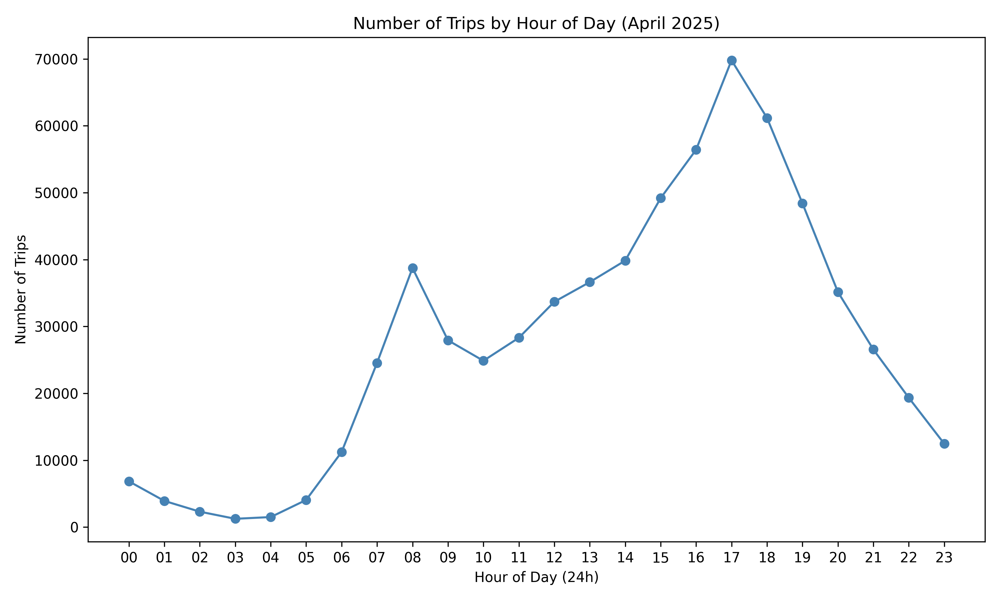
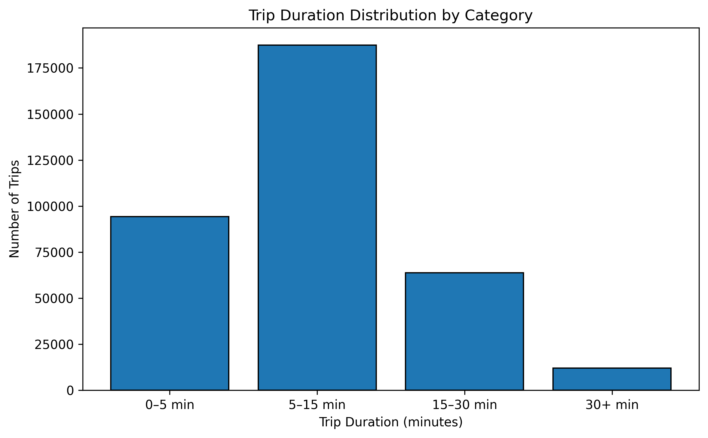
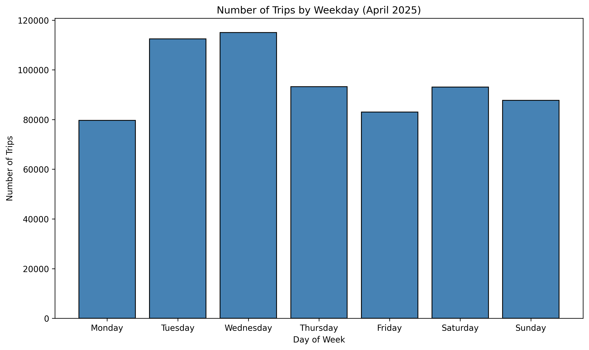
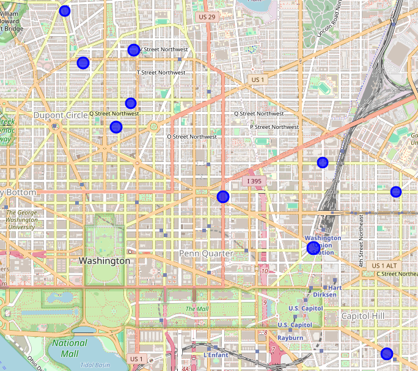

# Introduction

The dataset comes from Capital Bikeshare raw data available on their website (https://capitalbikeshare.com/system-data). Capital Bikeshare is MetroDC's bike sharing system. The network covers more than 700 stations and 6000 bikes. The available data is updated every month and includes trip duration, start date, end date, start station, end station, bike number and member type. In this report, we are looking only at the most recent data from April 2025 ("202504-capitalbikeshare-tripdata.zip") and using SQLite to query it. 

This analysis aims to answer key questions such as:
* which stations and routes are most used?
* what time of day are rides most frequent?
* how long are the trips?
* how does usage vary by weekday?
* who uses the system more - casual riders or members?

The queries below build a picture of how Capital Bikeshare is used throughout a typical spring month.

# Set-up Instructions

* download the April 2025 Capital Bikeshare data from here: https://s3.amazonaws.com/capitalbikeshare-data/index.html#:~:text=202504%2Dcapitalbikeshare%2Dtripdata.zip
* Use a SQLite tool to import it into a table called `trips` e.g. DB Browsser or `pandas_to_sql`
* Run queries from this project against your local database


# SQL Skills Demonstrated

* Filtering and cleaning data using `WHERE`and `IS NOT NULL`
* Aggregation with `GROUP BY`, `COUNT`and `AVG`
* Temporal analysis using `strftime()` and `julianday()`
* Categorisation with `CASE WHEN` statements
* Subqueries and nested `SELECT` statements
* Basic data validation (handling NULLS and outliers)

SQLite was selected for this project for its simplicity and low setup overhead. It allows for quick, local querying of structured CSV data and is good for showcasing SQL logic without needing a full database server. The data was transformed from a csv to a .db file using Python and then queried inside DB Browser.

All visualisations were generated in Python with matplotlib and folium. The code can be found in the `python_scripts` folder and the resulting figures under the `figures` folder.

# Visual Summary

|  |  |
|---------------------------------------------|---------------------------------------------------------------------|
| Trips by Time of Day          | Distribution of Trip Durations                        |

| |  |
|------------------------------------------------------------|--------------------------------------------------------------|
| Trips by Weekday                                           |Top Start Stations (Map)                       |


# Which is the most popular Bikeshare starting station in April 2025?

The goal is to identify the 10 most popular starting stations in April 2025. To achieve this, the ```SELECT```statement
retrieves each unique `start_station_name` and counts how many trips started there - that count is
labelled `trip_count`. The data is drawn from the `trips` table. Then, all rows are aggregated by starting station
name, so we can count how many trips began at each station. The results are ordered in **descending order**
using `ORDER BY` and the result is limited to the 10 top most used starting stations with `LIMIT`.
When the query was first run, **180038 trips** had NULL values for the starting station, skewing the results. Accuracy
is improved by excluding NULL values with a `WHERE` clause. However, given the very large number of NULL values, there
might be an error in the data collection process, and any analysis based on station names should be interpreted with caution.

## Query

```sql
SELECT start_station_name, 
       COUNT(*) AS trip_count
FROM trips
WHERE start_station_name IS NOT NULL
GROUP BY start_station_name
ORDER BY trip_count DESC
LIMIT 10;
```

## Results

**Table 1** identifies the 10 most popular starting stations in April 2025 by trip count. The map in **Figure 1** shows where they are in the city.

**Table 1:**  The 10 most popular starting stations in April 2025.

| Starting Station                | Trip Count |
|---------------------------------|------------|
| Columbus Circle / Union Station | 5462       |
| New Hampshire Ave & T St NW     | 4489       |
| 5th & K St NW                   | 4115       |
| 15th & P St NW                  | 3963       |
| Eastern Market Metro            | 3882       |
| 14th & V St NW                  | 3657       |
| 1st & M St NE                   | 3459       |
| Adams Mill & Columbia Rd NW     | 3402       |
| M St & Delaware Ave NE          | 3341       |
| 14th & R St NW                  | 3166       |


**Figure 1:** The 10 most popular starting stations in April 2025.

The popularity of these stations can be explained by their proximity to major activity hubs. Columbus Circle/Union Station is the city's main intermodal hub so it is a natural starting point for commuters and tourists. Three of the top ten are at residential-commercial border zones (New Hampsire Ave & T St NW, 14th & V St NW and 14th & R St NW). Three sit on the edge of core business districts, so they should be popular with commuters (5th & K St NW, 15th & P St NW and 1st & M St NW).  The civic and tourist areas affect the popularity of Eastern Market Metro and Adams Mill & Columbia Rd MW. Then M St & Delaware Ave NW serves densely populated neighbourhoods and likely functions as a residential-metro connector.

# What are the  most frequent trip pairs (origin-destination)?

The goal is to identify the ten most common trip pairs. Since the data includes many entries where the start_station
and/or end_station is empty (i.e. NULL), these must be excluded from the dataset first to leave us with valid, complete
routes only. We start by selecting the origin station, destination station and counts of those trips from the full trips
table (`FROM trips`). We filter out rows with missing start or end stations names
using `WHERE...IS NOT NULL AND ...IS NOT NULL`. We group the data by each unique start and end station
pair (`GROUP BY`) to count the trip frequency for each route, then sort the frequency of the trip pairs from most to
least (`ORDER BY trip_count DESC`), and limit the result to the top 10 most common trip pairs.

## Query

```sql
SELECT
  start_station_name,
  end_station_name,
  COUNT(*) AS trip_count
FROM trips
WHERE start_station_name IS NOT NULL
  AND end_station_name IS NOT NULL
GROUP BY start_station_name, end_station_name
ORDER BY trip_count DESC
LIMIT 10;
```

## Results

While Columbus Circle/Union Station is the most popular starting station, it does not dominate the trip pairs because - like from other major hubs - it disperses across different destinations.  The top pairs are frequently round drips (e.g. Gravelly Point, Jefferson Dr & 14th St SW), suggesting recreational use or circular routes.  Other high-ranking pairs connect closely located, well-trafficked areas (Capitol Hill - Eastern Market) suggestive of a mix of commuting, tourism and leisure across the city.

**Table 2:** The 10 most common trip pairs in April 2025.

| Start Station                                         | End Station                                           | Trip Count |
|-------------------------------------------------------|-------------------------------------------------------|------------|
| Gravelly Point                                        | Gravelly Point                                        | 514        |
| Columbus Circle / Union Station                       | 8th & F St NE                                         | 381        |
| Jefferson Dr & 14th St SW                             | Jefferson Dr & 14th St SW                             | 306        |
| Columbus Circle / Union Station                       | 6th & H St NE                                         | 300        |
| Smithsonian-National Mall / Jefferson Dr & 12th St SW | Smithsonian-National Mall / Jefferson Dr & 12th St SW | 293        |
| 8th & F St NE                                         | Columbus Circle / Union Station                       | 292        |
| Hains Point/Buckeye & Ohio Dr SW                      | Hains Point/Buckeye & Ohio Dr SW                      | 264        |
| Lincoln Park / 13th & East Capitol St NE              | Eastern Market Metro                                  | 263        |
| Eastern Market Metro                                  | Lincoln Park / 13th & East Capitol St NE              | 247        |
| 4th St & Madison Dr NW                                | 4th St & Madison Dr NW                                | 240        |


# Which time of day is most popular?

To analyse ride activity by time of day, the hour alone is extracted from each ride's start time. The times are given as
standard ISO 8601 timestamps with milliseconds e.g. **2025-04-30 23:59:58.007** but here, we are only interesteed in the
**hour of day** when the ride started. The SQLite function `sql strftime('%H', started_at)` extracts the hour in
24-hour format from each timestamp and the result as called "hour" using `AS hour`.

## Query

```sql
SELECT strftime('%H', started_at) AS hour, COUNT(*) AS trip_count
FROM trips
GROUP BY hour
ORDER BY hour;
```

## Results

There are two sets of peak hours what coincide with peak commuting times: 4-6 PM and 7-9 AM.


**Figure 2:** The most popular hour of day in April 2025.

# How long is the average trip?

In general terms, the average trip duration (minutes) is calculated as follows:
`average_duration_minutes = average(end_time - start_time) * conversion_factor_from_days_to_minutes `

## Query

```sql
SELECT
  ROUND(AVG((julianday(ended_at) - julianday(started_at)) * 1440), 1) AS avg_trip_minutes
FROM trips;
```

Firstly, to subtract days from each other, the timestamp must be converted into a Julian day number
with `julianday(datetime)`. However, this gives the duration in days as a floating point number, so we have to
convert it to minutes. To do so, we multiply by 24 hours * 60 minutes = `1440`. Then, `AVG()` calculates the average
duration across all trips as float with many trailing decimals. Therefore, we apply `ROUND(AVG(),1)` to round the
average duration to one decimal place.

## Results

The mean trip duration is 16.1 minutes. Since the mean is sensitive to outliers, let's look at the distribution of
trip durations.

# What is the distribution of trip durations (short, medium and long)?

The goal is to group the bike trips into duration categories and count how many fall into each category. The results are
shown as a histogram.

## Query

The query contains a subquery:

```sql
SELECT 
  (julianday(ended_at) - julianday(started_at)) * 1440 AS duration_min
FROM trips
WHERE started_at IS NOT NULL AND ended_at IS NOT NULL
```

The subquery calcluates trip duration in minutes by subtracting start from end times using `julianday()` and by
converting from days to minutes. Rows with missing values (NULL) in the start and/or end times are filtered out and the
result is a temporary table aliased `sub`.

The outer query deals with `CASE` expression which categorises the trips according to a labelled duration
bin. `CASE` is evaluated sequentially, so the conditions are ordered from smallest to largest
threshold. `COUNT(*)` counts the number of trips in each category, and the result is grouped by ``duration_category``
and sorted from most to least frequent.

```sql
SELECT
  CASE
    WHEN duration_min <= 5 THEN '0–5 min'
    WHEN duration_min <= 15 THEN '5–15 min'
    WHEN duration_min <= 30 THEN '15–30 min'
    ELSE '30+ min'
  END AS duration_category,
  COUNT(*) AS trip_count
FROM (
  SELECT 
    (julianday(ended_at) - julianday(started_at)) * 1440 AS duration_min
  FROM trips
  WHERE started_at IS NOT NULL AND ended_at IS NOT NULL
) AS sub
GROUP BY duration_category
ORDER BY trip_count DESC;
```

Note that this query does not address outliers but, even if a maximum time limit of 2 hours is applied, 3723 trips are
excluded, amounting to only 0.56% of all trips.

## Results

The most common ride duration is 5-15 minutes.

**Figure 3:** Histogram of trip durations in April 2025.

# Which day of the week has the most trips?

The goal is to identify which days of the week have the most trips. The day of the week is based on the day on which the
journey started `started_at`). The week starts on a Sunday, so the results are returned as 0 for Sunday through to 6
for Saturday.

## Query

The query groups the trips by day of the week and counts the number of trips for each day.

```sql
SELECT 
  strftime('%w', started_at) AS weekday,
  COUNT(*) AS trip_count
FROM trips
WHERE started_at IS NOT NULL
GROUP BY weekday
ORDER BY trip_count DESC;
```
Alternatively, the results can be returned by day of the week Monday to Sunday, rather than by number of trips:

```sql
SELECT 
  strftime('%w', started_at) AS weekday,
  COUNT(*) AS trip_count
FROM trips
WHERE started_at IS NOT NULL
GROUP BY weekday
ORDER BY 
  CASE strftime('%w', started_at)
    WHEN '1' THEN 1  -- Monday
    WHEN '2' THEN 2
    WHEN '3' THEN 3
    WHEN '4' THEN 4
    WHEN '5' THEN 5
    WHEN '6' THEN 6
    WHEN '0' THEN 7  -- Sunday last
  END;
```

## Results

The following results table is ordered by the number of trips, and it was manually altered for readability. I.e. "Sunday"
is listed instead of "0" and so on.

**Table 3:** Number of trips per weekday in April 2025.

| Weekday   | Number of Trips |
|-----------|-----------------|
| Wednesday | 115016          |
| Tuesday   | 112499          |
| Thursday  | 93269           |
| Saturday  | 93044           |
| Sunday    | 87695           |
| Friday    | 83013           |
| Monday    | 79663           |

If the results are ordered from Monday to Sunday instead - see the **Figure 4** below.


**Figure 4:** Number of trips per weekday in April 2025.

# What share of rides are taken by members vs casual ride sharers?

Journeys are grouped by whether the rider is a member of the bike sharing service or not. The goal is to identify
which group has the most trips.

## Query

```sql
SELECT
  member_casual,
  COUNT(*) AS trip_count,
  ROUND(100.0 * COUNT(*) / (SELECT COUNT(*) FROM trips), 1) AS percent_of_total
FROM trips
GROUP BY member_casual;
```

We `count` the trips per rider type, calling it `trip_count` and `(SELECT COUNT(*) FROM trips)` gets the total
number of trips in the dataset trips. Since it a percentage calculation, we use `ROUND(...,1)` to round it to one
decimal place. Using `100.0*...` ensures floating-point division as opposed to integer division.

## Results

The overwhelming majority of rides are taken by members (more than 70%).

**Table 4:** Percentage of rides taken by members vs casual riders in April 2025.

| Rider Type | Number of Trips | Percentage of Total |
|------------|-----------------|---------------------|
| casual     | 198192          | 29.8                |
| member     | 466007          | 70.2                |


# Conclusion
This exploratory analysis of Capital Bikeshare trips in April 2025 revealed several interesting insights:

* most trips are short: the average trip duration is 16.1 minutes and most trips are  5-15 minutes long
* the most popular starting stations are Columbus Circle / Union Station but no single origin-destination route dominates
* Tuesday and Wednesdays are the busiest days, whereas Monday and Friday have the fewest trips
* most users are members who account for over 70% of all trips
* the volume peak occurs between 4-6 PM and 7-9 AM, coinciding with peak commuting hours

This type of SQL-based analysis supports better understanding of bike-sharing patterns and could be extended to seasonal trends, user segmentation, or operational decisions such as station rebalancing.

