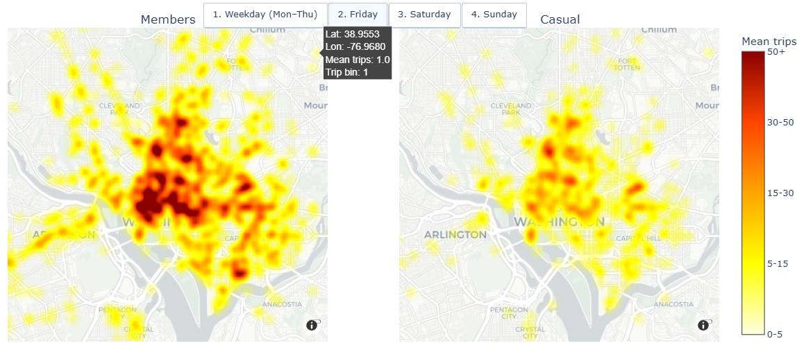
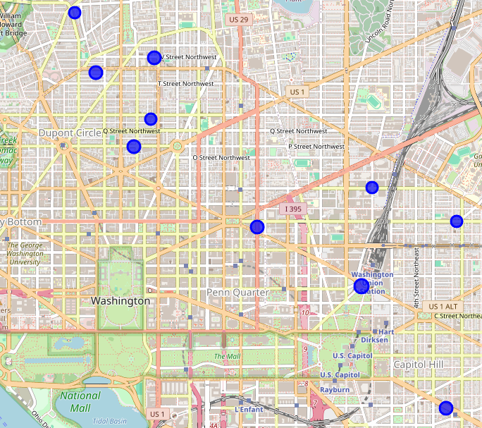
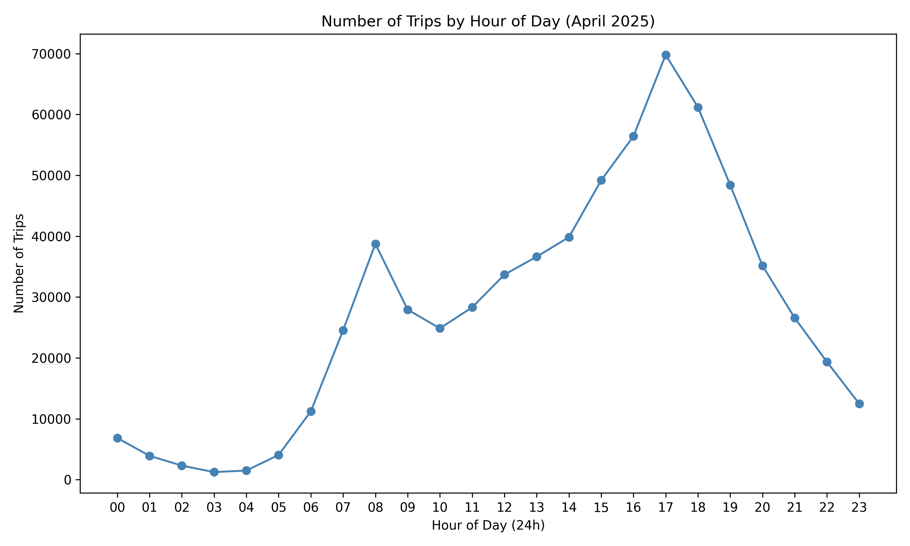
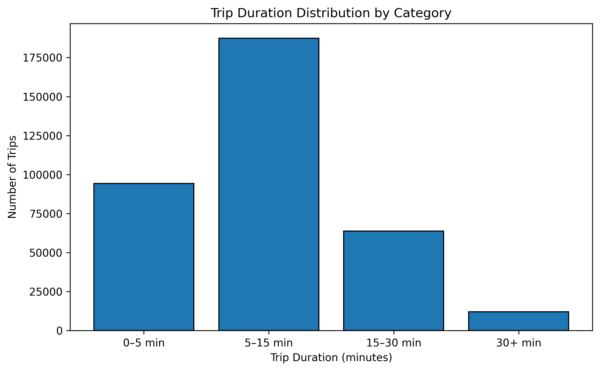
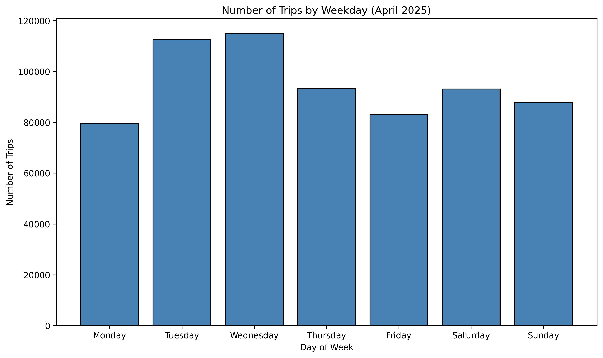

# Capital Bikeshare (April 2025) — SQL + Python Analysis (SQLite + BigQuery)

## Overview
This project analyzes **Capital Bikeshare trip data for April 2025** to understand usage patterns across stations, routes, time of day, trip duration, weekday, and rider type.

Data source: Capital Bikeshare system data (monthly raw trip data): https://capitalbikeshare.com/system-data

The repo supports two complementary workflows:
- **SQLite (local, reproducible)**: run SQL locally and generate static plots/maps  
  (`sql_scripts/` + `python_scripts/`)
- **BigQuery (cloud, scalable + interactive outputs)**: query in BigQuery, export CSV, and generate interactive outputs  
  (`bigquery_queries/`)

---

## Questions Answered
- Which stations and routes are most used?
- What time of day are rides most frequent?
- How long are the trips?
- How does usage vary by weekday?
- Who uses the system more: casual riders or members?

---

## Repository Layout
- `sql_scripts/` — SQL queries against the `trips` table (SQLite workflow)
- `python_scripts/` — SQLite query runners + plotting/map utilities (outputs saved to `figures/`)
- `bigquery_queries/` - BigQuery workflow scripts/notebook + interactive plotting/app
- `figures/` - generated static charts/maps
- `tests/` - tests that validate key outputs are produced
- `.github/workflows/ci.yml` - CI pipeline for linting + tests

---

## Setup (Python)
Create/activate a virtual environment and install dependencies:

```bash
python -m venv .venv
source .venv/bin/activate
pip install -r requirements.txt
```

### Quality checks + tests
```bash
ruff check . --fix
black .
flake8 .
pytest tests/
```

---

## Workflow A: SQLite (Local Analysis)
The SQLite workflow is designed for portable, offline analysis using a local database.

- SQL query files live in `sql_scripts/` and assume a `trips` table.
- Plot/map generation utilities are in `python_scripts/`.
- Outputs are saved to `figures/`.

Typical flow:
1. Load/build the SQLite database containing the `trips` table (see repo scripts/config for the expected DB path).
2. Run SQL scripts in `sql_scripts/` against that database.
3. Use `python_scripts/` to generate plots and maps from query outputs.

---

## Workflow B: BigQuery (Cloud Analysis + Heatmap)
The BigQuery workflow supports scalable querying, then exports results (optionally to CSV) to power plotting and an interactive map.

Set environment variables and run the BigQuery scripts:

```bash
export GOOGLE_APPLICATION_CREDENTIALS=/tmp/gcp_key.json
export BQ_PROJECT_ID=capitalbikeshare-489408
export BQ_TABLE_ID=capitalbikeshare-489408.02_2026.tripdata
# optional: export BQ_OUTPUT_CSV=tripdata.csv

python bigquery_queries/scripts.py
python bigquery_queries/plotting.py
```

This produces:
- `tripdata.csv` (optional query output, depending on configuration)
- `heatmap.html` (interactive Plotly map)

### Optional Interactive App
```bash
streamlit run bigquery_queries/app.py
```

---
### BigQuery heatmap showcase


The interactive heatmap generated from the BigQuery workflow is saved as `heatmap.html`.  
If you want a quick browser preview without cloning, you can use an HTML preview service (as long as `heatmap.html` is accessible from the repo).

---

## SQL & Engineering Skills Demonstrated
- Filtering/cleaning: `WHERE`, `IS NOT NULL`, positive-duration guards to exclude data entry errors
- Aggregation: `GROUP BY`, `COUNT`, `AVG`
- Time-series analysis: `strftime()`, `julianday()`
- Categorization: `CASE WHEN`
- CTEs (`WITH` clauses) to improve query readability and separate data-prep logic from aggregation
- Window functions (`SUM(...) OVER ()`) to compute group shares in a single pass, avoiding correlated subqueries
- Python-based pipelines for SQLite + BigQuery outputs
- Automated testing with `pytest`
- Formatting/linting: `black`, `flake8`, `ruff`
- CI with GitHub Actions (`.github/workflows/ci.yml`)

---

## Project Updates

### May 2025: Reproducibility + CI Improvements
This project was significantly enhanced in May 2025 with the following additions:

- Central `config.py` for setting global paths (e.g., `FIGURES_DIR`, database location)
- Automated plot generation for all major SQL outputs
- `pytest`-based test suite to ensure figures are created and contain data
- CI/CD integration using GitHub Actions (`.github/workflows/ci.yml`) to automate lint checks and test execution
- Code formatting (`black`) and linting (`flake8`, `ruff`) configured and documented
- Logical file structure:
  - `python_scripts/`: plotting and SQL query logic
  - `tests/`: validation of script outputs
  - `figures/`: generated charts and maps

These improvements make the project reproducible, extendable, and more maintainable for future updates and analyses.

### March 2026: BigQuery Integration & Enhanced Workflows
The project has been further extended with cloud-based analytics and improved testing infrastructure:

#### BigQuery Integration
- **Cloud-ready query workflow**: BigQuery query execution is implemented in `bigquery_queries/scripts.py` and demonstrated in `bigquery_queries/eda.ipynb`
- **Python query execution**: `scripts.py` reads `BQ_PROJECT_ID`, `BQ_TABLE_ID`, and optional `BQ_OUTPUT_CSV`, runs a grouped BigQuery query (weekday/member/location trip counts), and saves results for downstream plotting
- **Interactive exploration**: Jupyter notebook (`eda.ipynb`) demonstrates how to execute queries, process results, and generate visualizations interactively
- **Visualisation pipeline**: `plotting.py` and `app.py` transform BigQuery CSV outputs into interactive HTML maps/charts using Plotly and Folium

#### CSV-Based Workflow
- **Decoupled data and visualisation**: the BigQuery workflow writes query results to CSV (`tripdata.csv`) so plotting can run offline
- **Portable outputs**: generated CSV artifacts can be version-controlled, shared, and reused without re-running expensive queries
- **Local and cloud flexibility**: plots can be generated from either SQLite (local) or BigQuery (cloud) data sources

#### Enhanced Modularity
- **Separation of concerns**: query logic, data processing, and visualisation are isolated in dedicated modules
- **Reusable components**: functions in `scripts.py` and `plotting.py` support multiple query types and output formats
- **Configuration management**: centralized `config.py` ensures consistent paths across local and CI environments

#### Robust Testing & CI
- **Expanded test coverage**: tests validate plotting functions, HTML/PNG artifact creation, and BigQuery plotting module imports
- **Import path resolution**: `conftest.py` ensures `config.py` and project modules are discoverable in all environments (local, Docker, GitHub Actions)
- **Automated quality checks**: GitHub Actions workflow runs `pytest`, `black`, `flake8`, and `ruff` on every commit to maintain code quality and prevent regressions

These enhancements position the project for scalable cloud analytics while maintaining local development flexibility and comprehensive automated testing.

## Analysis Details (SQL Walkthroughs)

### Which is the most popular Bikeshare starting station in April 2025?
The goal is to identify the 10 most popular starting stations in April 2025. To achieve this, the `SELECT` statement
retrieves each unique `start_station_name` and counts how many trips started there — that count is
labelled `trip_count`. The data is drawn from the `trips` table.

All rows are grouped by starting station name (`GROUP BY`) so we can count how many trips began at each station.
The results are ordered in **descending order** using `ORDER BY`, and the result is limited to the 10 most-used starting stations with `LIMIT`.

When the query was first run, **180,038 trips** had NULL values for the starting station, skewing the results.
Accuracy is improved by excluding NULL values with a `WHERE` clause. However, given the very large number of NULL values,
there might be an issue in the data collection process, and any analysis based on station names should be interpreted with caution.

#### Query
```sql
SELECT start_station_name,
       COUNT(*) AS trip_count
FROM trips
WHERE start_station_name IS NOT NULL
GROUP BY start_station_name
ORDER BY trip_count DESC
LIMIT 10;
```

#### Results
**Table 1** identifies the 10 most popular starting stations in April 2025 by trip count. The map in **Figure 1** shows where they are in the city.

**Table 1:** The 10 most popular starting stations in April 2025.

| Starting Station                | Trip Count |
|---------------------------------|------------|
| Columbus Circle / Union Station | 5462       |
| New Hampshire Ave & T St NW     | 4489       |
| 5th & K St NW                   | 4115       |
| 15th & P St NW                  | 3963       |
| Eastern Market Metro            | 3882       |
| 14th & V St NW                  | 3657       |
| 1st & M St NE                   | 3459       |
| Adams Mill & Columbia Rd NW     | 3402       |
| M St & Delaware Ave NE          | 3341       |
| 14th & R St NW                  | 3166       |

  
**Figure 1:** The 10 most popular starting stations in April 2025.

The popularity of these stations can be explained by their proximity to major activity hubs. Columbus Circle/Union Station is the city’s main intermodal hub, so it is a natural starting point for commuters and tourists. Several of the other top stations sit at the edges of business districts or dense residential-commercial corridors, making them likely “connector” stations between Metro stops, workplaces, and neighborhood destinations.

---

### What are the most frequent trip pairs (origin–destination)?
The goal is to identify the ten most common trip pairs. Since the data includes many entries where the start station and/or end station is missing (i.e. NULL), these must be excluded first to leave only valid, complete routes.

We select the origin station, destination station, and counts of those trips from the `trips` table.
We filter out rows with missing station names using `WHERE ... IS NOT NULL`. Then we group by each unique start/end pair (`GROUP BY`) to count trip frequency, sort from most to least common (`ORDER BY trip_count DESC`), and limit to the top 10 (`LIMIT 10`).

#### Query
```sql
SELECT
  start_station_name,
  end_station_name,
  COUNT(*) AS trip_count
FROM trips
WHERE start_station_name IS NOT NULL
  AND end_station_name IS NOT NULL
GROUP BY start_station_name, end_station_name
ORDER BY trip_count DESC
LIMIT 10;
```

#### Results
While Columbus Circle/Union Station is the most popular starting station, it does not dominate the trip pairs because — like other major hubs — it disperses across many destinations. Several of the most frequent pairs are “round trips” (start and end at the same station), which suggests recreational use or short errands. Other high-ranking pairs connect closely located, well-trafficked areas, suggesting a mix of commuting, tourism, and leisure.

**Table 2:** The 10 most common trip pairs in April 2025.

| Start Station                                         | End Station                                           | Trip Count |
|-------------------------------------------------------|-------------------------------------------------------|------------|
| Gravelly Point                                        | Gravelly Point                                        | 514        |
| Columbus Circle / Union Station                       | 8th & F St NE                                         | 381        |
| Jefferson Dr & 14th St SW                             | Jefferson Dr & 14th St SW                             | 306        |
| Columbus Circle / Union Station                       | 6th & H St NE                                         | 300        |
| Smithsonian-National Mall / Jefferson Dr & 12th St SW | Smithsonian-National Mall / Jefferson Dr & 12th St SW | 293        |
| 8th & F St NE                                         | Columbus Circle / Union Station                       | 292        |
| Hains Point/Buckeye & Ohio Dr SW                      | Hains Point/Buckeye & Ohio Dr SW                      | 264        |
| Lincoln Park / 13th & East Capitol St NE              | Eastern Market Metro                                  | 263        |
| Eastern Market Metro                                  | Lincoln Park / 13th & East Capitol St NE              | 247        |
| 4th St & Madison Dr NW                                | 4th St & Madison Dr NW                                | 240        |

---

### Which time of day is most popular?
To analyze ride activity by time of day, we extract the hour from each ride’s start timestamp and count trips per hour.

The timestamps are ISO-like datetime strings with milliseconds (e.g. `2025-04-30 23:59:58.007`), but for this analysis we only need the **hour of day**. SQLite’s `strftime('%H', started_at)` extracts the hour (00–23).

A `WHERE started_at IS NOT NULL` guard is added so that rows with missing timestamps do not silently contribute to the counts (SQLite returns `NULL` from `strftime` for NULL inputs, which creates a spurious `NULL` hour group rather than raising an error).

#### Query
```sql
SELECT strftime('%H', started_at) AS hour, COUNT(*) AS trip_count
FROM trips
WHERE started_at IS NOT NULL
GROUP BY hour
ORDER BY hour;
```

#### Results
There are two peak periods that line up with commuting patterns: **morning (7–9 AM)** and **late afternoon (4–6 PM)**.

  
**Figure 2:** The most popular hour of day in April 2025.

---

### How long is the average trip?
The average trip duration (in minutes) can be computed by subtracting start time from end time, converting the difference from days to minutes, and averaging across all trips.

SQLite’s `julianday(datetime)` converts timestamps to a Julian day number. Subtracting two Julian day values gives a duration in **days**, so we multiply by `1440` (24 hours/day × 60 minutes/hour) to convert from days to minutes. We round to one decimal place for readability.

Before averaging, three data quality conditions are applied:
- `started_at IS NOT NULL` and `ended_at IS NOT NULL` — excludes rows where timestamps were never recorded
- `julianday(ended_at) > julianday(started_at)` — removes zero-duration and negative-duration records, which indicate docking errors or data entry issues

#### Query
```sql
SELECT
  ROUND(AVG((julianday(ended_at) - julianday(started_at)) * 1440), 1) AS avg_trip_minutes
FROM trips
WHERE started_at IS NOT NULL
  AND ended_at IS NOT NULL
  AND julianday(ended_at) > julianday(started_at);
```

#### Results
The mean trip duration is **16.1 minutes**. Since the mean is sensitive to outliers, the next section looks at the full distribution.

---

### What is the distribution of trip durations (short, medium and long)?
The goal is to group bike trips into duration categories and count how many fall into each category. The results are shown as a histogram.

Duration is computed from `started_at` and `ended_at` using `julianday()`, then converted to minutes. The same data quality filters from the previous query are applied here: rows with NULL timestamps and rows where the end time is not strictly after the start time are excluded before binning.

The query is structured as a CTE (`WITH trip_durations AS (...)`) to cleanly separate the data-preparation step — computing duration and filtering bad rows — from the aggregation step that bins and counts trips. This is equivalent to the inline subquery approach but is easier to read, test, and extend.

#### Query
```sql
WITH trip_durations AS (
  SELECT
    (julianday(ended_at) - julianday(started_at)) * 1440 AS duration_min
  FROM trips
  WHERE started_at IS NOT NULL
    AND ended_at IS NOT NULL
    AND julianday(ended_at) > julianday(started_at)
)
SELECT
  CASE
    WHEN duration_min <= 5 THEN '0–5 min'
    WHEN duration_min <= 15 THEN '5–15 min'
    WHEN duration_min <= 30 THEN '15–30 min'
    ELSE '30+ min'
  END AS duration_category,
  COUNT(*) AS trip_count
FROM trip_durations
GROUP BY duration_category
ORDER BY trip_count DESC;
```

#### Results
The most common ride duration is **5–15 minutes**.

  
**Figure 3:** Histogram of trip durations in April 2025.

Note: even if a maximum duration threshold of 2 hours is applied, **3,723 trips** are excluded (about **0.56%** of all trips), so the overall shape is robust to trimming extreme outliers.

---

### Which day of the week has the most trips?
The goal is to identify which days of the week have the most trips, based on the day the journey started (`started_at`).

SQLite’s `strftime('%w', started_at)` returns weekday codes with **0 = Sunday** through **6 = Saturday**.

Both queries are structured as CTEs: the CTE counts trips per weekday number once, and the outer query translates the numeric code to a human-readable name and applies the desired sort order. Separating aggregation from presentation logic in this way avoids re-evaluating `strftime` in both the `SELECT` and `ORDER BY` clauses and makes the intent of each step explicit.

#### Query (ordered by trip volume)
```sql
WITH weekday_trips AS (
  SELECT
    strftime('%w', started_at) AS weekday_num,
    COUNT(*) AS trip_count
  FROM trips
  WHERE started_at IS NOT NULL
  GROUP BY weekday_num
)
SELECT
  CASE weekday_num
    WHEN '0' THEN 'Sunday'
    WHEN '1' THEN 'Monday'
    WHEN '2' THEN 'Tuesday'
    WHEN '3' THEN 'Wednesday'
    WHEN '4' THEN 'Thursday'
    WHEN '5' THEN 'Friday'
    WHEN '6' THEN 'Saturday'
    ELSE 'Unknown'
  END AS weekday_name,
  trip_count
FROM weekday_trips
ORDER BY trip_count DESC;
```

#### Query (ordered Monday → Sunday)
```sql
WITH weekday_trips AS (
  SELECT
    strftime('%w', started_at) AS weekday_num,
    COUNT(*) AS trip_count
  FROM trips
  WHERE started_at IS NOT NULL
  GROUP BY weekday_num
)
SELECT
  CASE weekday_num
    WHEN '0' THEN 'Sunday'
    WHEN '1' THEN 'Monday'
    WHEN '2' THEN 'Tuesday'
    WHEN '3' THEN 'Wednesday'
    WHEN '4' THEN 'Thursday'
    WHEN '5' THEN 'Friday'
    WHEN '6' THEN 'Saturday'
    ELSE 'Unknown'
  END AS weekday_name,
  trip_count
FROM weekday_trips
ORDER BY
  CASE weekday_num
    WHEN '1' THEN 1  -- Monday
    WHEN '2' THEN 2
    WHEN '3' THEN 3
    WHEN '4' THEN 4
    WHEN '5' THEN 5
    WHEN '6' THEN 6
    WHEN '0' THEN 7  -- Sunday last
  END;
```

#### Results
The results below are ordered by the number of trips. Weekday names are now produced directly by the SQL query rather than added manually after the fact.

**Table 3:** Number of trips per weekday in April 2025.

| Weekday   | Number of Trips |
|-----------|-----------------|
| Wednesday | 115016          |
| Tuesday   | 112499          |
| Thursday  | 93269           |
| Saturday  | 93044           |
| Sunday    | 87695           |
| Friday    | 83013           |
| Monday    | 79663           |

If you view the chart ordered Monday-to-Sunday, the midweek peak becomes especially clear:

  
**Figure 4:** Number of trips per weekday in April 2025.

---

### What share of rides are taken by members vs casual ride sharers?
Journeys are grouped by whether the rider is a member of the bikeshare service or not. The goal is to quantify both the trip counts and the share of total rides.

We count trips per rider type and compute percentages using a **window function**. `SUM(COUNT(*)) OVER ()` computes the grand total across all groups in the same pass as the per-group counts, removing the need for a correlated subquery (`SELECT COUNT(*) FROM trips`) that scans the table a second time. Using `100.0 * ...` ensures floating-point division rather than integer division.

#### Query
```sql
SELECT
  member_casual,
  COUNT(*) AS trip_count,
  ROUND(100.0 * COUNT(*) / SUM(COUNT(*)) OVER (), 1) AS percent_of_total
FROM trips
GROUP BY member_casual;
```

#### Results
The overwhelming majority of rides are taken by members (**70.2%**).

**Table 4:** Percentage of rides taken by members vs casual riders in April 2025.

| Rider Type | Number of Trips | Percentage of Total |
|------------|-----------------|---------------------|
| casual     | 198192          | 29.8                |
| member     | 466007          | 70.2                |

---

## Conclusion
This exploratory analysis of Capital Bikeshare trips in April 2025 revealed several interesting insights:

- Most trips are short: the average trip duration is **16.1 minutes** and most trips are **5–15 minutes** long
- The most popular starting station is **Columbus Circle / Union Station**, but no single origin–destination route dominates
- **Tuesdays and Wednesdays** are the busiest days, whereas **Mondays and Fridays** have the fewest trips
- Most users are **members**, accounting for **~70%** of all trips
- Trip volume peaks around commuting windows (**7–9 AM** and **4–6 PM**)

This type of SQL-based analysis supports better understanding of bike-sharing patterns and could be extended to seasonal trends, user segmentation, or operational decisions such as station rebalancing.
